This project documents the configuration of a Security Information and Event Management (SIEM) lab using Elastic Cloud. The lab simulates a real-world Security Operations Center (SOC) environment to practice threat detection, log analysis, and detection rule engineering. Two attack scenarios were successfully executed and detected, demonstrating practical skills relevant to an L1 SOC Analyst role.

## Lab Architecture
- **SIEM Platform:** Elastic Cloud Serverless (Security Project)
- **Log Shipper:** Elastic Agent (Fleet-managed)
- **Monitored Endpoint:** Ubuntu Server 22.04 LTS (VirtualBox VM)
- **Attacker Machine:** Kali Linux (VirtualBox VM)

---

## Detection Engineering Exercises

### 1. SSH Brute Force Attack Detection

#### Attack Description
An adversary attempts to gain unauthorized access to a server by systematically trying a list of passwords against a valid username via the SSH service.

#### Simulation Steps
1. Created a test user account on the Ubuntu server with a weak password.
2. Used `hydra` from Kali Linux to launch a dictionary attack:

    ```bash
    hydra -l testuser -P /usr/share/wordlists/rockyou.txt ssh://<UBUNTU-IP> -t 4
    ```

#### Detection Rule Configuration (Kibana)
- **Rule Type:** Custom Query
- **Rule Name:** `SSH Brute Force Attempt - Home Lab`
- **Query (KQL):**
  ```
  event.dataset : "system.auth" AND system.auth.ssh.event : "Failed"
  ```
- **Threshold:** > 5 failed attempts within 1 minute, grouped by `source.ip`
- **Severity:** Medium
- **MITRE ATT&CK Mapping:**
  - Tactic: Credential Access (TA0006)
  - Technique: T1110.001 - Password Guessing

#### Alert Validation
The rule successfully triggered within minutes of initiating the `hydra` attack. The alert contained the source IP, target user, and count of failed attempts.

#### Screenshots

| Description | Image |
| :--- | :--- |
| Hydra brute force attack in progress | 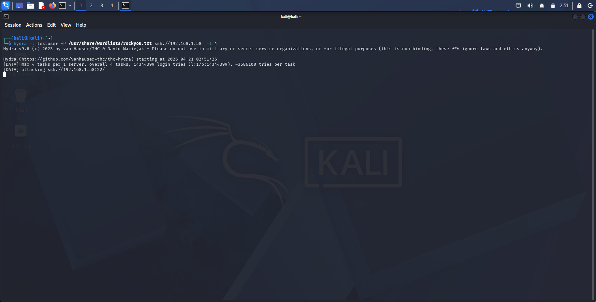 |
| Failed SSH logs in Kibana Discover | 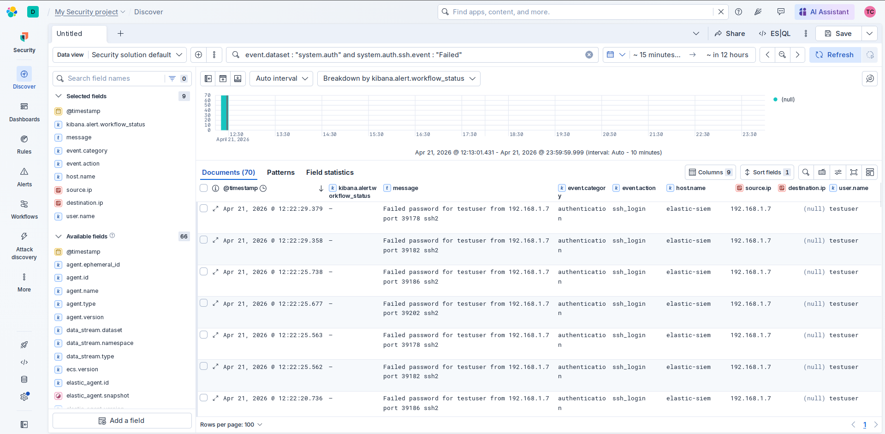 |
| Detection rule configuration (General) | 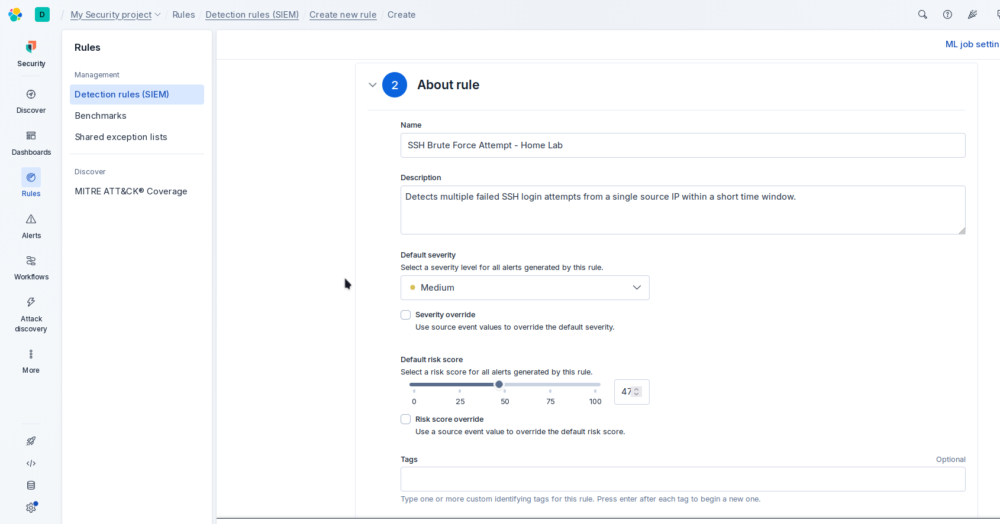 |
| MITRE ATT&CK Technique Mapping | 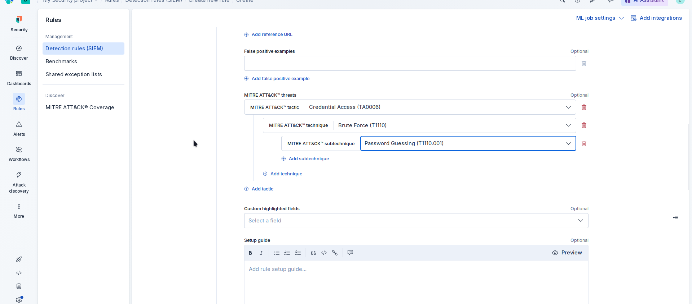 |
| Detection rule creation page |  |
| Triggered alert in Security > Alerts | 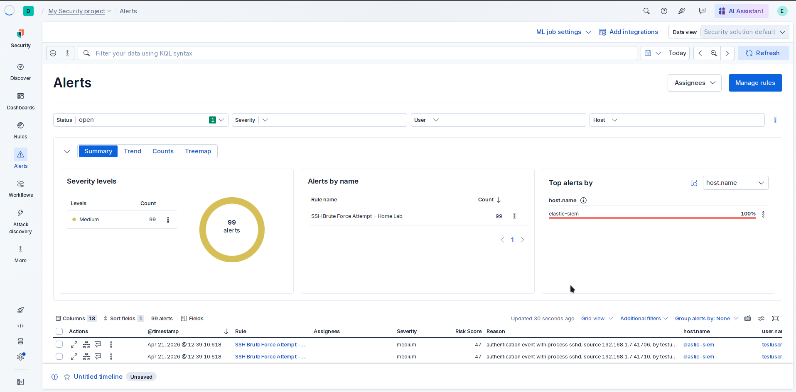 |

---

### 2. Web Application Scanning Detection

#### Attack Description
An attacker performs reconnaissance against a web server by scanning for open ports, vulnerabilities, and hidden directories—common precursors to exploitation.

#### Simulation Steps
1. Installed and started Apache2 on the Ubuntu server:

    ```bash
    sudo apt install -y apache2
    sudo systemctl start apache2
    ```

2. From the Kali Linux VM, executed the following scanning tools:
   - **Nmap:** `nmap -sV -p 80 <UBUNTU-IP>`
   - **Nikto:** `nikto -h http://<UBUNTU-IP>`
   - **Gobuster:** `gobuster dir -u http://<UBUNTU-IP> -w /usr/share/wordlists/dirb/common.txt`

#### Detection Rule Configuration (Kibana)
- **Rule Type:** Custom Query
- **Rule Name:** `Web Application Scanning Detected`
- **Query (KQL):**
  ```
  (event.dataset : "apache.access" AND http.response.status_code : 404) OR (url.path : ("*wp-admin*" or "*.php*" or "*admin*"))
  ```
- **Threshold:** > 15 events within 2 minutes, grouped by `source.ip`
- **Severity:** Low
- **MITRE ATT&CK Mapping:**
  - Tactic: Reconnaissance (TA0043)
  - Technique: T1595.002 - Vulnerability Scanning

#### Alert Validation
The rule triggered after running `gobuster`, which generated a high volume of 404 responses. The alert correctly identified the scanning source IP and the targeted web paths.

#### Screenshots

| Description | Image |
| :--- | :--- |
| Apache installation and status | 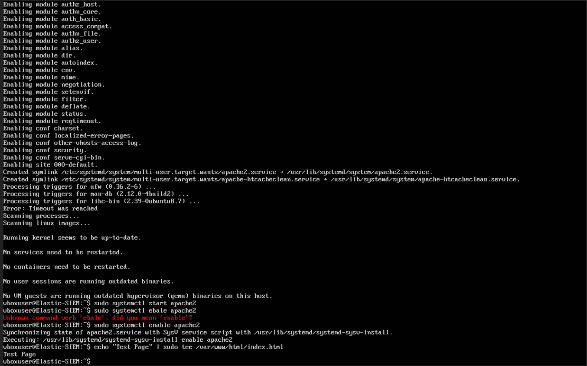 |
| Apache integration confirmed in Fleet | 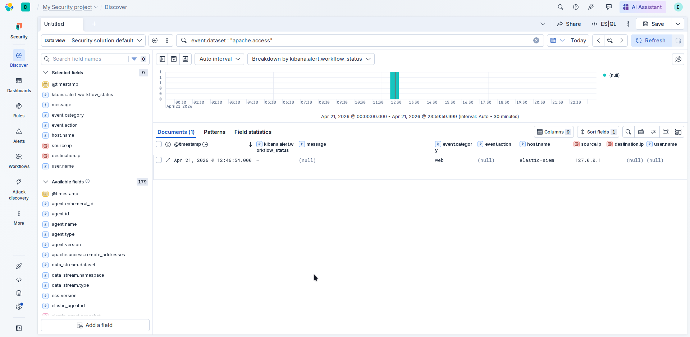 |
| Web scanning tools output (nmap, nikto, gobuster) | 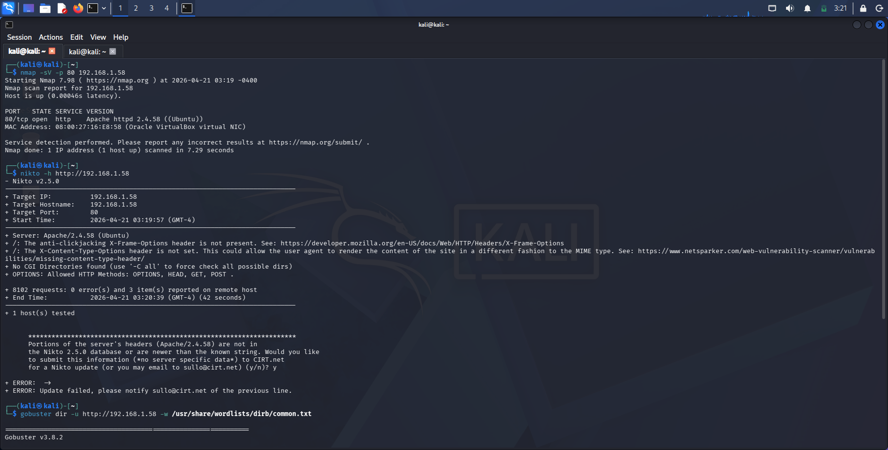 |
| Detection rule creation step 1 | 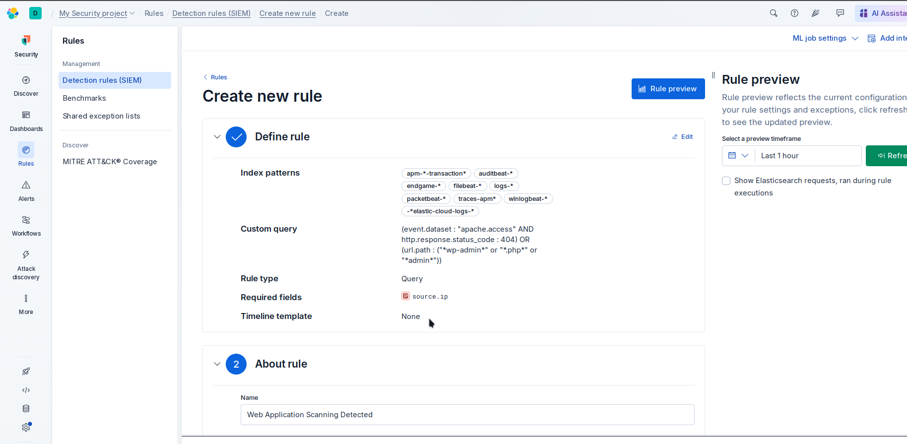 |
| Detection rule creation step 2 | 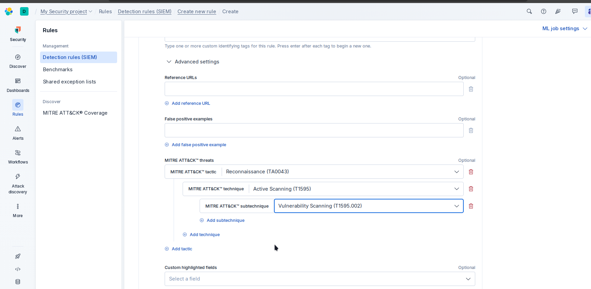 |
| Triggered alert in Security > Alerts | 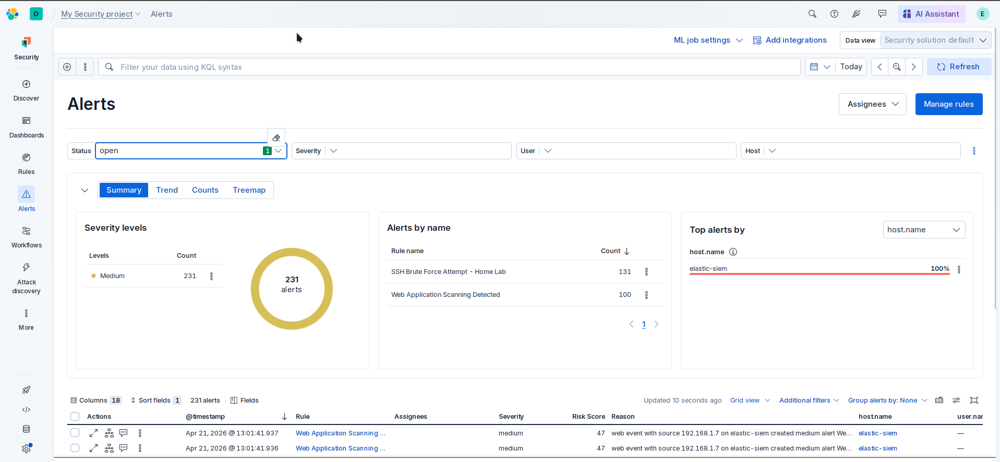 |

---

## Key Skills Demonstrated
- Deployment and configuration of Elastic Cloud SIEM
- Fleet-managed Elastic Agent installation on Linux
- Log analysis using Kibana Discover and KQL
- Custom detection rule engineering with threshold logic
- MITRE ATT&CK framework application
- Attack simulation using Kali Linux tools
- Technical documentation

Challenges and Lessons Learned


Data View Configuration: Ensuring the correct data view (logs-*) was selected in Kibana Discover was critical for viewing ingested logs.

Future Enhancements

Integrate Windows event logs via Sysmon for cross-platform detection

Deploy Suricata for network-based intrusion detection

Automate alert notifications to Slack or email

Implement cron persistence detection using journald log analysis
